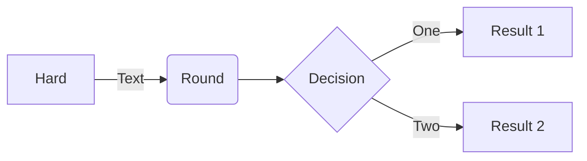

```mermaid
2
sequenceDiagram
3
Alice->>John: Hello John, how are you?
4
loop HealthCheck
5
    John->>John: Fight against hypochondria
6
end
7
Note right of John: Rational thoughts!
8
John-->>Alice: Great!
9
John->>Bob: How about you?
10
Bob-->>John: Jolly good!
11

12

13
```
